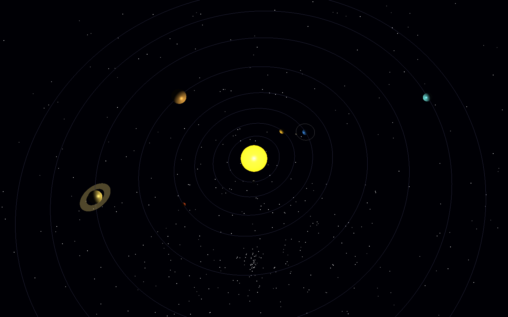
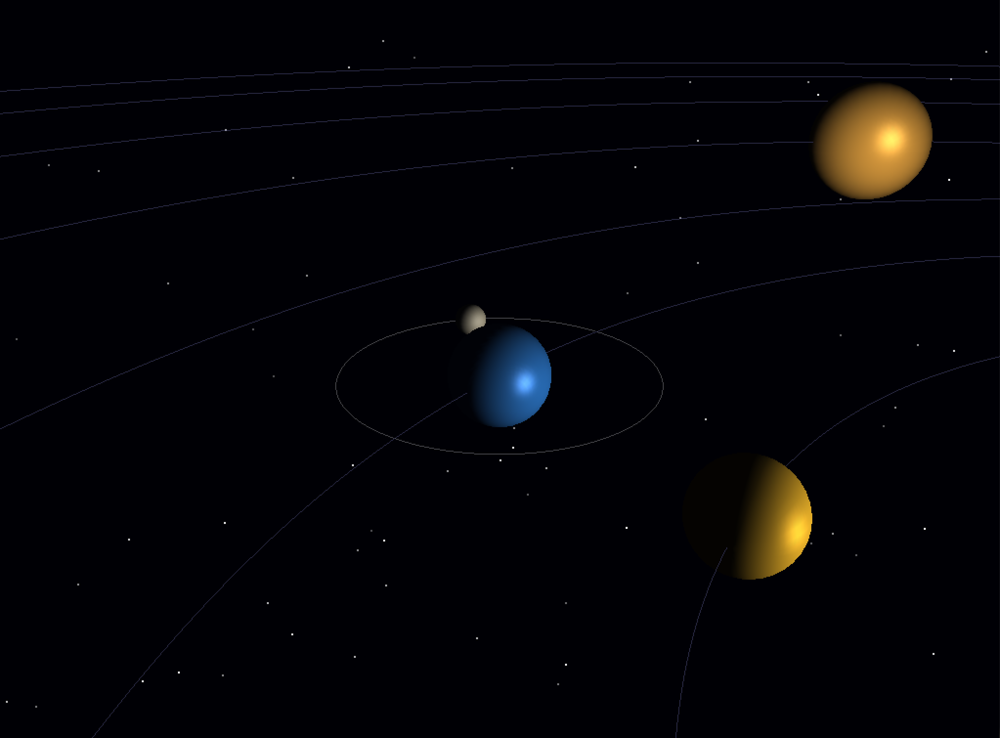

# Sistem Solar 3D

##  Descriere
O simulare interactivă în timp real a Sistemului Solar, construită cu OpenGL și GLUT. Proiectul redă cele 8 planete care orbitează Soarele pe traiectorii eliptice, împreună cu Luna care orbitează Pământul, inelele lui Saturn, 2000 de stele de fundal și ceață cosmică dinamică — totul iluminat prin pipeline-ul de iluminare cu funcții fixe al OpenGL.

## Funcționalități
- Toate cele 8 planete (Mercur → Neptun) cu culori, dimensiuni și orbite eliptice unice
- Inelele semi-transparente ale lui Saturn, redate cu `GL_TRIANGLE_STRIP`
- Luna Pământului cu propria traiectorie orbitală
- 2000 de stele distribuite aleatoriu cu luminozitate variabilă
- Ceață cosmică dinamică folosind `GL_FOG` în modul `GL_EXP2`
- Două surse de lumină: `GL_LIGHT0` la originea Soarelui și `GL_LIGHT1` pentru highlight-ul suprafeței solare
- Cameră arcball: rotire prin drag mouse, zoom prin scroll, rotire prin taste săgeți
- Modul de focalizare pe planetă — meniu click-dreapta pentru a bloca camera pe orice planetă
- Traiectorii orbite, axe de coordonate și ceață activabile/dezactivabile
- Pauză/Reluare animație și factor de viteză reglabil
- Display Lists OpenGL pre-compilate pentru stele, orbite și axe (optimizare performanță)

##  Tehnologii folosite
C++, OpenGL (pipeline cu funcții fixe), GLUT, `GL_LIGHTING`, `GL_FOG`, Display Lists, umbrire Gouraud

## Cum se rulează

**macOS (necesită Xcode Command Line Tools):**

```bash
g++ SistemSolar.cpp -o SistemSolar \
    -framework OpenGL -framework GLUT \
    -Wno-deprecated-declarations

./SistemSolar
```

**Controale:**

| Tastă / Acțiune | Efect |
|---|---|
| `P` | Pauză / Reluare animație |
| `+` / `-` | Mărire / Micșorare viteză |
| `R` | Resetare cameră |
| `A` | Afișare / Ascundere axe coordonate |
| `O` | Afișare / Ascundere traiectorii orbite |
| `F` | Afișare / Ascundere ceață cosmică |
| `ESC` | Ieșire |
| Taste săgeți | Rotire cameră |
| Drag stânga mouse | Rotire cameră |
| Scroll mouse | Zoom in / out |
| Click dreapta | Meniu GLUT (focalizare planetă, setări) |

## 📷 Capturi de ecran




##  Ce am învățat
- **Modelul de iluminare OpenGL**: Am configurat mai multe surse de lumină (`GL_LIGHT0` pentru Soare, `GL_LIGHT1` pentru un highlight specular în spațiul camerei) și am setat proprietăți de material per-obiect (`GL_AMBIENT`, `GL_DIFFUSE`, `GL_SPECULAR`, `GL_EMISSION`, `GL_SHININESS`) pentru a obține o umbrire realistă a planetelor.
- **Transformări ierarhice**: Am folosit `glPushMatrix` / `glPopMatrix` imbricate pentru a compune independent translația orbitală, rotația proprie, înclinarea inelelor și sub-orbita Lunii pentru fiecare corp ceresc.
- **Matematica orbitelor eliptice**: Am parametrizat orbitele folosind semi-axe majore (X) și minore (Z) separate, calculând pozițiile cu `cos` / `sin` la fiecare cadru în loc de un rază circulară fixă.
- **Display Lists pentru performanță**: Am pre-compilat câmpul stelar, inelele orbitelor și axele de coordonate în `GLuint` display lists, astfel încât acestea să se redea cu un singur `glCallList` pe cadru în loc să retrimită geometria.
- **Transparență și blending**: Am aplicat `GL_BLEND` cu `GL_SRC_ALPHA / GL_ONE_MINUS_SRC_ALPHA` pentru inelele lui Saturn și liniile de orbită, și am folosit `GL_DEPTH_MASK(GL_FALSE)` în timpul redării inelelor pentru a evita artefactele depth-buffer.
- **Camera arcball**: Am implementat rotație fluidă prin drag mouse și zoom prin scroll folosind coordonate sferice (azimut + elevație), convertind în coordonate carteziene pentru `gluLookAt`.
- **Sistemul de meniu GLUT**: Am construit un meniu contextual ierarhic la click-dreapta cu sub-meniuri pentru focalizarea pe planetă și comutarea vizibilității, folosind `glutCreateMenu` și `glutAddSubMenu`.
